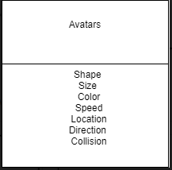
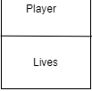
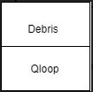
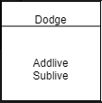
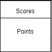
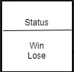
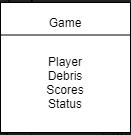

## Assignment 7 - Designing The Game

## Azizz Mills

#### Description:

To use **UML** to design a simple game by describing the classes and what the need and do.

## The charts below are the different classes for assignment 7's game design. They are as follows:

### Avatars

- Has a Shape
- Contains the attributes that make up the Player and Debris

### Player 

- Contains staring amount of lives for the player

### Debris 

- Loops the debris until the game is over

### Dodge 

- Registers collisions and adds or substracts lives

### Scores 

- The amount of times player dodges and gets hit when game is complete

### Status 

- Decides whether the player wins or loses based on the amount of points gained

### Game

- It is the "int main" to run the game
